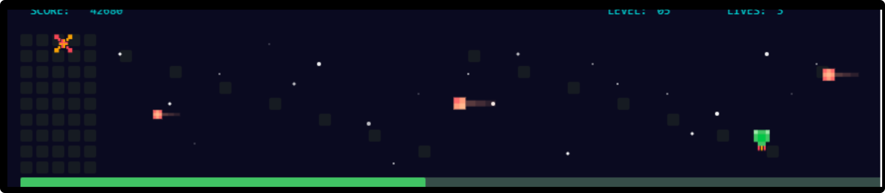

# Pixel Space Battle SVG Animation



## Sobre o Projeto

Uma animação SVG interativa inspirada em jogos espaciais retrô de 8-bits. Esta animação apresenta uma nave espacial combatendo cometas em um ambiente de pixel art completamente criado usando apenas SVG e CSS - sem JavaScript externo!

## Características

- **Animação Avançada Puramente SVG/CSS**: Todo o movimento e interatividade são construídos usando keyframes CSS e técnicas SVG avançadas
- **Estética Pixel Art Autêntica**: Design fiel aos jogos arcade clássicos com pixels meticulosamente alinhados
- **Totalmente Responsivo**: Adaptável a qualquer tamanho de tela sem perder qualidade (vantagem do formato vetorial)
- **Tema Escuro Integrado**: Suporte nativo para modo claro/escuro através de CSS moderno
- **Independente de Plataforma**: Funciona em qualquer navegador moderno sem necessidade de plugins ou bibliotecas

## Elementos de Animação

- 🚀 **Nave Espacial**: Com motor animado e sistemas de disparo
- ☄️ **Cometas**: Múltiplos cometas com partículas de cauda animadas
- 💥 **Explosões**: Efeitos de explosão ao estilo retro
- ⭐ **Estrelas Cintilantes**: Fundo espacial dinâmico
- 🎮 **UI de Jogo**: Pontuação, nível e vidas no estilo arcade clássico

## Especificações Técnicas

- **Tecnologias**: SVG + CSS (sem JavaScript)
- **Tamanho do Arquivo**: ~15KB (compacto e otimizado)
- **Compatibilidade**: Todos os navegadores modernos
- **Acessibilidade**: Cores de alto contraste e elementos semânticos

## Como Usar

1. **Incorporação Direta**: Copie o código SVG para seu HTML:
   ```html
   <embed src="pixel-space-battle.svg" type="image/svg+xml" width="880" height="192">
   ```

2. **Como Imagem**: Use como qualquer imagem em HTML:
   ```html
   
   ```

3. **Background CSS**: Aplique como background em CSS:
   ```css
   .game-section {
     background-image: url('pixel-space-battle.svg');
     background-repeat: no-repeat;
     background-size: contain;
   }
   ```

## Personalização

O SVG utiliza variáveis CSS que podem ser facilmente modificadas para alterar as cores e o estilo:

```css
:root {
  --background: #0a0a20;
  --ship-color: #40c463;
  --comet-color1: #ff6b6b;
  /* outras variáveis de cores... */
}
```

## Inspiração

Este projeto foi inspirado pelos jogos de arcade clássicos dos anos 80 e pela visualização de contribuições do GitHub, trazendo nostalgia dos jogos pixelados com tecnologias web modernas.

## Licença

Este projeto está licenciado sob a licença MIT - veja o arquivo LICENSE para detalhes.

---

Criado com ❤️ usando apenas SVG e CSS
